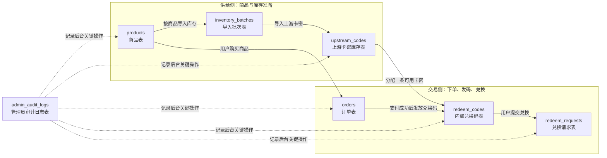

# Gift 卡密兑换项目方案（A售卖 / B兑换 / C后台）

## 一、项目目标

搭建一个基于 **Node + React + Next.js** 的卡密业务系统，满足以下业务流程：

1. 我从上游采购一批卡密
2. 将上游卡密批量导入自己的系统
3. 客户在 **zka 售卖端** 购买商品
4. 系统给客户发放 **内部兑换码**
5. 客户在 **zka 兑换端** 使用内部兑换码提交兑换信息
6. 系统在后台使用绑定的上游卡密调用上游接口完成兑换
7. 我通过 **zka 后台** 管理商品、库存、订单、兑换记录和异常处理

---

## 二、核心业务边界（已确定）

### 已确认规则

1. 卖给客户的是 **内部兑换码**
2. 客户在 B 平台使用的是 **内部兑换码**
3. 上游卡密是 **后台兑换触发凭证**
4. **一个订单对应一张卡**
5. 第一版支持失败后重试，但仅对 **可重试失败** 开放；`processing` 状态继续轮询，`failed_final` 不再自动重试
6. 第一期前台不做登录体系，用户侧查询以 **输入内部兑换码** 为主，不做订单列表中心

---

## 三、推荐架构结论

### 结论

不要做三套彼此独立的系统。
推荐做成：

> **一个核心系统 + 三个不同入口（A / B / C）**

### 三个入口

- **zka 售卖端**
- **zka 兑换端**
- **zka 后台管理端**

### 一个核心系统负责

- 商品
- 库存卡密
- 内部兑换码
- 订单
- 兑换请求
- 上游接口调用
- 日志与审计

---

## 四、推荐技术栈

### 主栈

- **Next.js**
- **React**
- **TypeScript**
- **Node.js**

### 推荐配套

- **SQLite**：主数据库，后续再迁移到 PostgreSQL
- **Prisma**：ORM
- **Ant Design**：后台界面和常用组件
- **后台保护**：前期不接完整登录系统，A / B 不做登录，C 先用单管理员密码保护
- **Zod**：接口参数校验
- **console.log**（前期）/ **Pino**（后期）：日志
- **Redis / BullMQ**：前期先不引入，后期如有异步任务、限流、重试需求再加

### 起步建议

先做 **模块化单体（Modular Monolith）**，不要一开始拆微服务。

---

## 五、业务架构设计

### 1. zka 售卖端

职责：

- 商品展示
- 下单支付
- 支付完成后展示内部兑换码
- 发放内部兑换码
- 给用户引导去 B 平台兑换

客户买完后看到的是：

- 商品信息
- 订单号
- 内部兑换码
- 去兑换入口

---

### 2. zka 兑换端

职责：

- 输入内部兑换码
- 输入 `session_info`
- 提交兑换请求
- 按内部兑换码查看兑换结果 / 状态

注意：

- 客户永远看不到上游卡密
- 客户也不应直接调用上游接口

---

### 3. zka 后台

职责：

- 商品管理
- 上游卡密批量导入
- 查看库存
- 查看订单
- 查看兑换记录
- 异常处理
- 审计日志

---

## 六、完整业务流

### 流程 1：采购入库

1. 我从上游购买一批卡密
2. 在后台导入系统
3. 系统按批次保存这些卡密
4. 卡密进入库存池，等待售卖

---

### 流程 2：客户下单

1. 客户在 A 平台购买某商品
2. 支付成功后，系统从库存池分配一张上游卡密
3. 系统生成一张 **内部兑换码**
4. 内部兑换码和该订单、该上游卡密绑定
5. 订单状态变为已交付

---

### 流程 3：客户兑换

1. 客户在 B 平台输入内部兑换码
2. 客户提交 `session_info`
3. 系统校验兑换码是否合法、是否已使用
4. 系统找到绑定的上游卡密
5. 系统调用上游 `/api/activate`
6. 系统保存兑换结果
7. 返回用户兑换状态

---

### 流程 4：异常处理

如果兑换失败：

- 根据上游返回信息决定是否允许重试
- 若允许重试，进入可重试状态
- 若不允许，进入最终失败状态
- 后台支持人工查看和处理

---

## 七、为什么不直接卖上游卡密

### 不建议直接把上游卡密发给客户

原因：

- 暴露上游格式
- 容易被绕过业务逻辑
- 不利于风控
- 不利于切换上游
- 不利于后续审计和售后

### 内部兑换码的好处

- 只暴露自己的业务层
- 可冻结 / 撤销
- 便于限流和风控
- 可追踪订单与兑换全流程
- 以后更换供应商不影响前台

---

## 八、最小数据模型

---

### 1. 商品表 `products`

字段建议：

- `id`：主键 ID
- `name`：商品名称
- `slug`：商品唯一标识，便于生成短链接或路由
- `description`：商品说明
- `price`：售卖价格
- `status`：商品状态，比如上架或下架
- `createdAt`：创建时间
- `updatedAt`：最后更新时间

状态建议：

- `draft`：草稿状态，商品已创建但暂不对外展示
- `active`：上架状态，商品可正常售卖和下单
- `inactive`：下架状态，商品保留但暂时不售卖
- `archived`：归档状态，仅保留历史记录，不再参与日常运营

---

### 2. 导入批次表 `inventory_batches`

字段建议：

- `id`：主键 ID
- `batchNo`：批次编号
- `supplierName`：供应商名称
- `productId`：对应商品 ID
- `costPrice`：该批次的进货单价
- `quantity`：本批次导入数量
- `remark`：备注说明
- `createdAt`：创建时间

作用：

- 区分每批卡密来源
- 方便后续对账和成本统计

---

### 3. 上游卡密库存表 `upstream_codes`

字段建议：

- `id`：主键 ID
- `productId`：对应商品 ID
- `batchId`：所属导入批次 ID
- `upstreamCodeEncrypted`：加密保存后的上游卡密
- `upstreamCodeHash`：上游卡密哈希值，用于去重、唯一约束和快速检索
- `status`：卡密当前状态
- `boundOrderId`：绑定的订单 ID
- `assignedAt`：分配给订单的时间
- `activatedAt`：卡密被激活或使用的时间
- `invalidAt`：卡密失效时间
- `lastErrorMessage`：最近一次上游失败原因
- `createdAt`：创建时间
- `updatedAt`：最后更新时间

建议状态：

- `in_stock`：已入库，未分配给任何订单，可参与库存分配
- `reserved`：已被系统临时预留，用于防止并发重复分配，尚未正式绑定订单
- `bound`：已正式绑定到订单和内部兑换码，等待用户提交兑换
- `submitted`：用户已提交兑换，系统已使用该上游卡密向上游发起请求
- `success`：上游兑换成功，该卡密已被实际消耗，不可再次使用
- `failed`：本次兑换失败，当前进入人工确认状态，后续可恢复为 `bound` 或改为 `invalid`
- `invalid`：卡密已失效或确认不可用，不再参与后续兑换

注意：

- 上游卡密建议加密保存
- 上游卡密建议同时保存哈希值，避免因加密字段无法直接做唯一约束而重复导入
- 后台默认脱敏展示

---

### 4. 订单表 `orders`

字段建议：

- `id`：主键 ID
- `orderNo`：订单编号
- `userId`：userId 可选，未登录时可为空
- `productId`：购买商品 ID
- `amount`：订单金额
- `paymentProvider`：支付渠道，第一版固定为 `alipay`
- `paymentTradeNo`：支付宝交易号
- `paymentBuyerId`：支付宝买家 ID，可选
- `paymentStatus`：支付状态
- `fulfillmentStatus`：履约状态
- `paymentNotifiedAt`：收到并确认支付回调的时间
- `paymentCallbackRaw`：支付回调原始报文，建议保存为 JSON
- `createdAt`：下单时间
- `paidAt`：支付完成时间
- `deliveredAt`：内部兑换码发放时间
- `updatedAt`：最后更新时间

关系建议：

- 一期建议只保留 `redeem_codes.orderId` 作为订单与兑换码的唯一关联，不在 `orders` 表中反向冗余保存 `redeemCodeId`

#### paymentStatus 支付状态建议

- `pending`：待支付，用户尚未完成付款
- `paid`：已支付，订单付款成功
- `failed`：支付失败
- `closed`：订单已关闭，比如超时未支付或主动取消
- `refunded`：已退款

#### fulfillmentStatus 履约状态建议

- `pending`：待履约，订单尚未完成发码或交付
- `delivered`：已履约，兑换码或卡密已发放
- `closed`：已关闭，订单不再继续履约

---

### 5. 内部兑换码表 `redeem_codes`

字段建议：

- `id`：主键 ID
- `code`：内部兑换码内容
- `orderId`：关联订单 ID
- `productId`：对应商品 ID
- `upstreamCodeId`：关联的上游卡密 ID
- `status`：兑换码状态
- `issuedAt`：兑换码发放时间
- `submittedAt`：提交兑换的时间
- `redeemedAt`：兑换成功时间
- `lockedAt`：兑换码锁定时间
- `lastErrorMessage`：最近一次兑换失败原因
- `updatedAt`：最后更新时间

状态建议：

- `unused`：已发放但尚未提交兑换，可正常使用
- `submitted`：用户已提交兑换信息，系统正在处理本次兑换请求
- `success`：兑换成功，该兑换码已完成使用
- `failed`：本次兑换失败，是否允许重试需结合失败原因判断
- `locked`：兑换码已被锁定，通常用于风控、异常处理或人工介入场景

---

### 6. 兑换请求表 `redeem_requests`

说明：

- 用于记录每一次兑换提交到上游的执行过程和结果，便于重试、排错、审计

字段建议：

- `id`：主键 ID
- `requestNo`：请求编号
- `redeemCodeId`：关联兑换码 ID
- `userId`：userId 可选，未登录时可为空
- `attemptNo`：第几次兑换尝试，从 `1` 开始递增
- `retryOfRequestId`：如果是重试请求，则记录上一次请求 ID
- `sessionInfoMasked`：脱敏后的会话信息，确定是哪个会话/账号上下文
- `sessionInfoHash`：会话信息的哈希值，给系统做比对
- `status`：请求状态
- `upstreamStatusCode`：上游归一化状态码，例如 `0`、`-1`、`1`
- `upstreamResponse`：上游返回的响应内容
- `errorMessage`：失败原因说明
- `submittedAt`：提交到上游的时间
- `completedAt`：请求处理完成时间
- `createdAt`：创建时间
- `updatedAt`：最后更新时间

状态建议：

- `submitted`：已提交兑换请求，等待处理
- `processing`：上游处理中
- `success`：兑换成功
- `failed_retryable`：兑换失败，但可以再次重试
- `failed_final`：兑换失败，且不建议继续重试

---

### 7. 管理员审计日志表 `admin_audit_logs`

字段建议：

- `id`：主键 ID
- `adminUserId`：操作管理员 ID
- `action`：操作类型
- `targetType`：操作对象类型
- `targetId`：操作对象 ID
- `detail`：操作详情
- `createdAt`：记录创建时间

---

### 8. 业务流程图



流程理解：

- 先创建 `products`，再按商品导入 `inventory_batches`
- 每个导入批次会写入多条 `upstream_codes`，作为可分配的上游卡密库存
- 用户购买商品后生成 `orders`
- 订单支付成功后，系统为该订单发放一条 `redeem_codes`
- 发放兑换码时，会绑定一条可用的 `upstream_codes`
- 用户实际提交兑换时，会生成一条 `redeem_requests`，记录本次请求过程和结果
- `admin_audit_logs` 用于记录后台对商品、库存、订单、兑换码、兑换请求等关键操作

---

## 九、页面结构建议

### zka 售卖端

- `/`：首页 / 商品列表页
- `/products/[slug]`：商品详情页，展示单个商品信息
- `/checkout/[slug]`：当前商品的下单 / 结算页
- `/orders`：二期可选的订单列表页；一期不做登录订单中心时可不实现
- `/orders/[orderNo]`：支付完成后的订单结果页，展示内部兑换码；一期不作为通用查询入口

### zka 兑换端

- `/redeem`：兑换提交页，用户输入内部兑换码并填写兑换信息
- `/redeem/result/[requestNo]`：兑换结果页，展示本次请求的处理状态和结果

### zka 后台

- `/admin/login`：后台登录页
- `/admin/products`：商品管理页
- `/admin/inventory`：库存 / 上游卡密管理页
- `/admin/orders`：订单管理页
- `/admin/redeems`：兑换记录 / 兑换请求管理页
- `/admin/batches`：卡密导入批次管理页
- `/admin/audit-logs`：管理员审计日志查看页

---

## 十、API 设计建议

### A 平台

- `GET /api/products`：获取商品列表，用于首页或商品列表页展示
- `GET /api/products/:slug`：获取单个商品详情
- `POST /api/orders/create`：创建订单，生成待支付订单记录
- `POST /api/orders/pay/callback`：接收支付宝异步回调（`notify_url`），更新订单支付状态并发放内部兑换码
- `GET /api/orders/:orderNo`：一期仅供支付完成页展示订单结果，不做登录后的订单中心查询

### B 平台

- `POST /api/redeem/submit`：提交兑换请求，触发系统调用上游接口执行兑换
- `GET /api/redeem/status/:requestNo`：查询本次兑换请求的处理状态和结果
- `POST /api/redeem/check-code`：校验内部兑换码是否存在、是否可用、是否已被锁定，也是一期主要查询入口

### C 平台

- `POST /api/admin/inventory/import`：后台批量导入上游卡密库存
- `GET /api/admin/inventory`：查询库存卡密列表及当前状态
- `GET /api/admin/orders`：查询订单列表
- `GET /api/admin/redeems`：查询兑换记录 / 兑换请求列表
- `POST /api/admin/redeems/:id/retry`：对指定失败兑换请求发起重试
- `POST /api/admin/redeem-codes/:id/lock`：锁定指定兑换码，禁止继续使用

### 内部上游适配函数

- `activateUpstreamCode(code, sessionInfo)`：调用上游平台接口，使用上游卡密和会话信息执行实际兑换
- `checkUpstreamCode(code)`：检查上游卡密是否有效、是否可用

---

## 十一、上游接口 Mock 协议（依据 `gift_check_activate_api.md` 抽象）

### 1. 上游基础规则

- 上游基础路径为 `/api`
- 一期本地服务端统一使用 **POST** 调用上游，避免把敏感参数放在 URL 中
- 上游接口统一返回：

```json
{
  "success": true,
  "msg": "描述信息",
  "data": {}
}
```

- `success=true` 不一定代表业务最终成功，仍需结合 `data.use_status` 或 `msg` 判断
- 本地数据库不保存完整 `session_info` 明文，只在请求内存中使用；落库时仅保存 `sessionInfoMasked` 与 `sessionInfoHash`

### 2. 查询接口 `/api/check`

- 请求参数：`cdkey`
- 用途：查询上游卡密当前状态，适合在重试前、异常对账时做状态确认

`use_status` 建议按以下方式归一化：

- `0`：可用 / 待提交
- `-1`：处理中
- `1`：已完成
- `-9`：库存不足或暂不可提交，归类为可重试失败
- `-999`：卡密异常，归类为不可用
- `-1000`：卡密已作废，归类为不可用

### 3. 激活接口 `/api/activate`

- 请求参数：`cdkey`、`session_info`
- `session_info` 为 JSON 字符串，一期至少要求能解析出 `account.planType`
- 当 `account.planType !== "free"` 时，本地直接判定为用户输入类最终失败，不继续消耗上游调用

### 4. 本地适配层建议返回统一结果

```ts
type NormalizedUpstreamResult = {
  ok: boolean;
  state:
    | 'available'
    | 'processing'
    | 'success'
    | 'retryable_failure'
    | 'final_failure'
    | 'invalid';
  message: string;
  upstreamStatusCode?: number;
  account?: string;
  completedAt?: string;
  raw: unknown;
};
```

这样业务层不需要到处解析上游原始 `msg` 与 `use_status`。

---

## 十二、支付宝支付方案与回调规则

### 1. 支付渠道选择

- 第一版固定使用 **支付宝电脑网站支付**
- 服务端通过支付宝官方 SDK 生成支付链接或表单，客户端跳转支付
- 创建订单后，本地返回 `orderNo`、`amount`、`paymentProvider`、`payUrl`

### 2. 回调入口

- 异步回调地址：`POST /api/orders/pay/callback`
- 同步跳转地址：建议跳到 `/orders/[orderNo]`
- 同步跳转只负责页面展示，**不能**作为支付成功依据

### 3. 支付回调处理规则

支付回调落地时，建议按以下顺序处理：

1. 读取支付宝回调表单参数
2. 使用支付宝官方 SDK 的 `checkNotifySignV2` 验签
3. 根据 `out_trade_no` 查找本地订单
4. 校验 `app_id`、`out_trade_no`、`total_amount`、`trade_no` 与本地订单是否一致
5. 仅当 `trade_status` 为 `TRADE_SUCCESS` 或 `TRADE_FINISHED` 时，才把本地订单改为已支付
6. 在同一事务中完成：更新订单支付状态、分配上游卡密、生成内部兑换码、写审计日志
7. 处理成功后，响应纯文本 `success`

### 4. 幂等要求

- 支付宝可能重复通知，同一笔订单的回调处理必须幂等
- 若本地订单已经是 `paid`，再次收到相同回调时应直接返回 `success`
- `orders.paymentTradeNo` 建议做唯一约束，防止同一支付宝交易号被重复写入不同订单
- 回调时必须先保存 `paymentCallbackRaw`，方便售后排查

### 5. 一期实现边界

- 一期不做登录订单中心，不提供订单列表查询
- 支付完成后的展示页只负责给用户展示内部兑换码和去兑换入口
- 用户后续查询兑换进度时，统一通过内部兑换码进入 B 平台查询

---

## 十三、数据库约束与索引建议

### 1. 唯一约束建议

- `products.slug`：唯一
- `inventory_batches.batchNo`：唯一
- `upstream_codes.upstreamCodeHash`：唯一
- `orders.orderNo`：唯一
- `orders.paymentTradeNo`：唯一，可为空
- `redeem_codes.code`：唯一
- `redeem_codes.orderId`：唯一
- `redeem_codes.upstreamCodeId`：唯一
- `redeem_requests.requestNo`：唯一
- `redeem_requests(redeemCodeId, attemptNo)`：联合唯一

### 2. 常用索引建议

- `products(status, createdAt)`
- `inventory_batches(productId, createdAt)`
- `upstream_codes(productId, status)`
- `upstream_codes(batchId, createdAt)`
- `upstream_codes(boundOrderId)`
- `orders(paymentStatus, createdAt)`
- `orders(fulfillmentStatus, createdAt)`
- `orders(productId, createdAt)`
- `redeem_codes(status, issuedAt)`
- `redeem_codes(orderId)`
- `redeem_requests(redeemCodeId, createdAt)`
- `redeem_requests(status, createdAt)`
- `redeem_requests(sessionInfoHash)`
- `admin_audit_logs(targetType, targetId, createdAt)`

### 3. 事务与并发要求

- 分配库存时，必须在事务内把 `upstream_codes.status` 从 `in_stock` 改为 `reserved`，通过受影响行数确保同一张卡不会被并发抢到
- 支付回调成功后，必须在同一事务内完成：`orders` 更新、`upstream_codes` 绑定、`redeem_codes` 生成
- 提交兑换时，必须在同一事务内完成：新建 `redeem_requests`、更新 `redeem_codes.status`、更新 `upstream_codes.status`
- SQLite 一期没有复杂锁机制时，优先使用“条件更新 + 事务”而不是先查再改

---

## 十四、状态流转规则

### 1. 商品 `products.status`

- `draft -> active`
- `active -> inactive`
- `inactive -> active`
- `active | inactive -> archived`

### 2. 订单 `orders.paymentStatus`

- `pending -> paid`：支付宝异步回调验签成功，且 `trade_status` 为 `TRADE_SUCCESS` 或 `TRADE_FINISHED`
- `pending -> failed`：下单阶段支付创建失败
- `pending -> closed`：超时未支付或主动取消
- `paid -> refunded`：发生退款

### 3. 订单 `orders.fulfillmentStatus`

- `pending -> delivered`：已成功发放内部兑换码
- `pending -> closed`：支付失败、退款或人工关闭

### 4. 上游卡密 `upstream_codes.status`

- `in_stock -> reserved`：支付回调处理中，先临时锁库存
- `reserved -> bound`：兑换码生成成功，正式绑定到订单
- `reserved -> in_stock`：支付回调事务失败，库存释放回池子
- `bound -> submitted`：用户提交兑换，请求已发往上游
- `submitted -> success`：上游确认兑换成功
- `submitted -> bound`：本次失败但卡密仍可重试，比如冷却、库存不足、用户会话错误
- `submitted -> failed`：结果不明确，进入人工确认
- `submitted -> invalid`：上游确认卡密异常、已作废或不可用
- `failed -> bound`：管理员确认可再次尝试
- `failed -> invalid`：管理员确认该卡密不可再用

### 5. 内部兑换码 `redeem_codes.status`

- `unused -> submitted`：用户提交兑换
- `submitted -> success`：兑换成功
- `submitted -> failed`：兑换失败，可由用户或管理员决定是否再次重试
- `unused -> locked`：管理员手工锁定
- `failed -> submitted`：用户再次提交或后台发起重试
- `failed -> locked`：异常次数过多或需要人工介入
- `locked -> unused | failed`：管理员解锁后恢复

### 6. 兑换请求 `redeem_requests.status`

- `submitted -> processing`：上游返回处理中
- `submitted -> success`
- `submitted -> failed_retryable`
- `submitted -> failed_final`
- `processing -> success`
- `processing -> failed_retryable`
- `processing -> failed_final`

注意：

- `redeem_requests` 每次重试都应新建一条记录，不要把旧记录改回 `submitted`
- 同一兑换码的下一次重试请求，`attemptNo = 上一次 attemptNo + 1`
- 一期不做自动队列重试，只支持用户再次提交或后台人工重试
- `failed_final` 描述的是“当前这次请求不应按原参数继续重试”，不一定等于“这张兑换码永久失效”；若失败原因是用户输入问题且卡密仍为 `bound`，允许用户重新提交新的请求

### 7. 上游结果到本地状态映射建议

#### `/api/check` 结果映射

- `use_status = 0`：本地保持可用，通常对应 `upstream_codes.bound`
- `use_status = -1`：本地请求状态设为 `processing`
- `use_status = 1`：本地请求与兑换码一起落为 `success`
- `use_status = -9`：本地请求设为 `failed_retryable`，卡密退回 `bound`
- `use_status = -999`：本地卡密设为 `invalid`，请求设为 `failed_final`
- `use_status = -1000`：本地卡密设为 `invalid`，请求设为 `failed_final`

#### `/api/activate` `msg` 映射

- `参数缺少或错误`：`failed_final`，但卡密回到 `bound`
- `Session信息或账号异常 请复制全部内容重新提交`：`failed_final`，但卡密回到 `bound`
- `该账号当前plan为{plan} 无法进行充值`：`failed_final`，但卡密回到 `bound`
- `CDKEY 正在充值中`：`processing`
- `礼物库存不足，请等待15分钟后再试或联系管理员补货`：`failed_retryable`，卡密回到 `bound`
- `该卡密暂时无法提交，{n} 分钟后恢复`：`failed_retryable`，卡密回到 `bound`
- `未找到对应cdk`：`failed_final`，卡密设为 `invalid`
- `CDK异常`：`failed_final`，卡密设为 `invalid`
- `CDK已作废`：`failed_final`，卡密设为 `invalid`
- `CDKEY 已充值成功`：先调用一次 `/api/check` 二次确认，若确认完成则落为 `success`
- `充值过程中发生异常`：优先记为 `failed_retryable`，等待人工重试，不在一期做自动死循环重试

---

## 十五、接口请求 / 响应示例

### 1. 创建订单 `POST /api/orders/create`

请求示例：

```json
{
  "productSlug": "chatgpt-plus-1m"
}
```

响应示例：

```json
{
  "success": true,
  "message": "订单创建成功",
  "data": {
    "orderNo": "ORD202604020001",
    "amount": "158.00",
    "paymentProvider": "alipay",
    "payUrl": "https://openapi.alipay.com/gateway.do?...",
    "paymentStatus": "pending"
  }
}
```

### 2. 校验兑换码 `POST /api/redeem/check-code`

请求示例：

```json
{
  "code": "GIFT-9X2K-7WQ4-ABCD"
}
```

响应示例：

```json
{
  "success": true,
  "message": "兑换码可用",
  "data": {
    "code": "GIFT-9X2K-7WQ4-ABCD",
    "status": "unused",
    "canSubmit": true,
    "productName": "ChatGPT Plus 月卡"
  }
}
```

### 3. 提交兑换 `POST /api/redeem/submit`

请求示例：

```json
{
  "code": "GIFT-9X2K-7WQ4-ABCD",
  "sessionInfo": "{\"account\":{\"id\":\"user-xxx\",\"planType\":\"free\"},\"accessToken\":\"ey...\",\"user\":{\"email\":\"test@example.com\"}}"
}
```

响应示例：

```json
{
  "success": true,
  "message": "兑换请求已提交",
  "data": {
    "requestNo": "REQ202604020001",
    "status": "submitted"
  }
}
```

### 4. 查询兑换结果 `GET /api/redeem/status/:requestNo`

响应示例：

```json
{
  "success": true,
  "message": "查询成功",
  "data": {
    "requestNo": "REQ202604020001",
    "status": "processing",
    "statusHint": "上游处理中，请稍后刷新",
    "retryable": false
  }
}
```

### 5. 支付回调报文示例 `POST /api/orders/pay/callback`

支付宝回调通常为表单字段，例如：

```text
out_trade_no=ORD202604020001
trade_no=2026040222001400000000000001
trade_status=TRADE_SUCCESS
total_amount=158.00
app_id=2021000000000000
seller_id=2088xxxxxxxxxxxx
sign=base64-signature
sign_type=RSA2
```

本地处理成功后，响应内容应为：

```text
success
```
